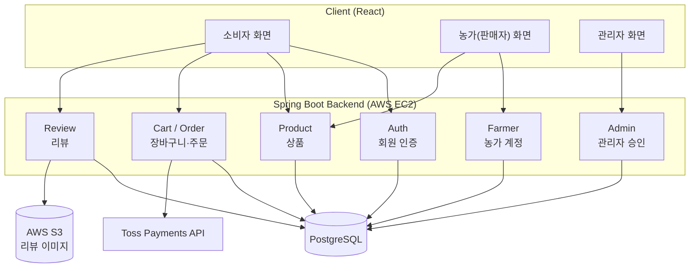
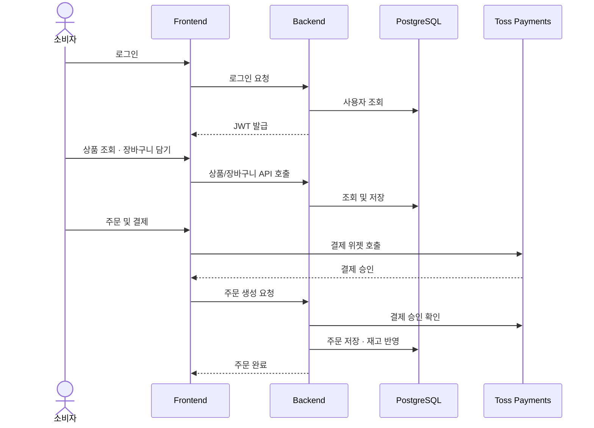

# 바로팜 — 로컬푸드 직매장 플랫폼 (Backend)

농가(판매자)가 직접 상품을 등록해 판매하고 소비자가 구매하는 로컬푸드 직거래 플랫폼의 백엔드입니다. 관리자 승인 구조와 B2B 요청 기능을 포함합니다.

> 팀 프로젝트로 진행했습니다 (2025.04–12, 총 5명 참여). PL(프로젝트 리더)을 맡아 프로젝트를 총괄했고, 그중 회원 인증·농가 계정·리뷰·관리자 승인 백엔드를 직접 개발했습니다.

## 담당 역할

- PL(프로젝트 리더)로 프로젝트 전체 진행 총괄
- 회원 인증, 농가(판매자) 계정 관리, 리뷰, 관리자 승인 기능 백엔드 개발
- 프로젝트 막바지 AWS EC2 배포 단독 진행

## 시스템 구성도

## 전체 흐름도

소비자가 상품을 주문하는 핵심 플로우입니다.

> Backend 저장소: [barofarm-backend](https://github.com/JOOON9286/barofarm-backend) · Frontend 저장소: [barofarm-frontend](https://github.com/JOOON9286/barofarm-frontend)

## 주요 기능

- 회원가입/로그인 등 인증(Auth) API
- 농가(판매자) 계정 관리 API
- 리뷰 등록·조회 API (이미지 업로드 포함)
- 관리자 승인·관리 기능 API

## 기술 스택

- Java, Spring Boot, Spring Data JPA, Spring Security, JWT
- PostgreSQL
- AWS EC2

## 배포

AWS EC2 — 프로젝트 막바지(2025.12) 본인이 단독으로 배포 진행
